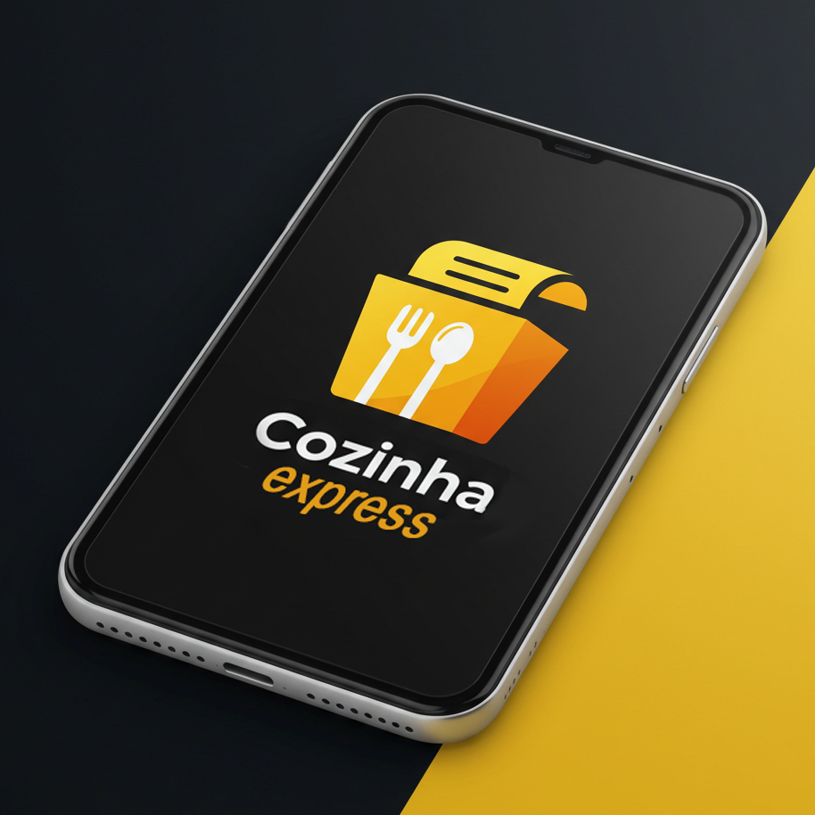

# 🍽️ CozinhaExpress

## Feito por Joao Pedro H Neves e Davi Fiori

Projeto criado com Expo para facilitar o desenvolvimento de aplicativos mobile.

---

## Como começar

1. Instale as dependências:
   ```bash
   npm install
   ```

2. Inicie o aplicativo:
   ```bash
   npx expo start
   ```

Você poderá abrir o app em um emulador Android, iOS ou no próprio dispositivo usando o Expo Go.

---

## Desenvolvimento

- Edite os arquivos dentro da pasta **app** para começar a desenvolver.
- O projeto utiliza roteamento baseado em arquivos.

---

## Resetar o projeto

Se quiser começar do zero, execute:
```bash
npm run reset-project
```
Isso irá mover o código de exemplo para a pasta **app-example** e criar uma nova pasta **app** em branco.

---

## Sobre

Este projeto foi desenvolvido para estudos e prática de desenvolvimento mobile com Expo.

---

## Teste no Expo Go

O app CozinhaExpress está disponível para teste via Expo Go. Siga as instruções abaixo para acessá-lo:

- **QR Code**: Escaneie o QR Code abaixo com o app Expo Go no seu dispositivo iOS ou Android para testar o app diretamente.


---

# CozinhaExpress



**CozinhaExpress** é um aplicativo de receitas desenvolvido com React Native e Expo, projetado para ajudar usuários a descobrir e explorar receitas de forma prática e intuitiva. O app permite buscar receitas por ingredientes, visualizar detalhes de preparo e gerenciar informações de usuário, como alteração de senha e exclusão de conta.

## Funcionalidades Principais

- **Autenticação de Usuário**: Login e cadastro de usuários com validação de e-mail e senha.
- **Busca de Receitas**: Liste receitas e busque por ingredientes específicos usando a API do TheMealDB.
- **Detalhes de Receitas**: Visualize instruções completas e lista de ingredientes de cada receita.
- **Gerenciamento de Conta**: Altere sua senha ou exclua sua conta diretamente pelo app.

## Tecnologias Utilizadas

- **React Native** com **Expo**: Framework para desenvolvimento mobile multiplataforma.
- **Expo Router**: Sistema de navegação baseado em arquivos.
- **Backend Personalizado**: Integração com API RESTful hospedada em RailWay para autenticação e gerenciamento de usuários.
- **API TheMealDB**: Fonte de dados para receitas e ingredientes.

## Pré-requisitos

- Node.js (versão 16 ou superior)
- Expo CLI (`npx expo`)
- Dispositivo iOS ou emulador iOS (para compatibilidade com o desenvolvedor)

## Como Rodar o Projeto

1. **Clone o Repositório**:
   ```bash
   git clone <URL_DO_REPOSITORIO>
   cd cozinhaexpress
   ```

2. **Instale as Dependências**:
   ```bash
   npm install
   # ou
   yarn install
   ```

3. **Inicie o Servidor de Desenvolvimento**:
   ```bash
   npx expo start
   ```

4. **Teste no Dispositivo ou Emulador**:
   - Escaneie o QR code gerado com o app Expo Go no seu dispositivo iOS.
   - Ou pressione `i` no terminal para abrir no emulador iOS (se configurado).

## Estrutura do Projeto

- `app/`: Contém as rotas e telas principais do app (receitas, usuário, etc.).
- `components/`: Componentes reutilizáveis, como tela de autenticação e elementos de UI.
- `styles/`: Arquivos de estilos separados para cada componente.
- `hooks/`: Hooks personalizados para autenticação, temas e cores.
- `constants/`: Definições de cores e temas.
- `assets/`: Imagens, ícones e fontes usadas no app.

## Testes Manuais

Consulte o arquivo [TESTES.md](TESTES.md) para detalhes sobre os cenários de teste manuais realizados no app, cobrindo login, busca de receitas e alteração de senha.

## Publicação

O app está publicado no Expo Go para testes. Para acessar:
1. Baixe o app **Expo Go** na App Store (iOS).
2. Escaneie o QR code fornecido após executar `npx expo publish` ou acesse o link do projeto publicado (a ser fornecido pelo desenvolvedor).

## Contribuição

Se desejar contribuir para o projeto, por favor, abra uma issue ou envie um pull request com suas sugestões ou correções.
